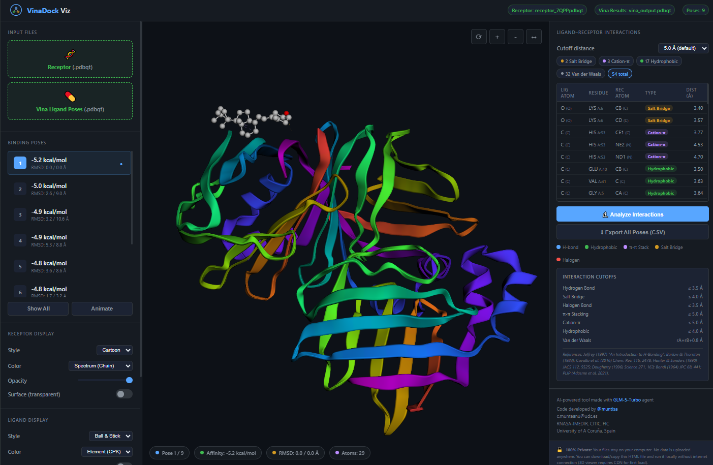

# VinaDock Viz

> _Interactive 3D visualization of AutoDock Vina molecular docking results — directly in your browser._

[](https://muntisa.github.io/VinaDock-Viz/VinaDock_Viz.html)     


Your files never leave your computer. Just load the receptor and the Vina docking output file with all the ligand poses (all in pdbqt).

---

## Screenshot



## Overview

**VinaDock Viz** is a single-file, serverless HTML+JS application that visualizes molecular docking results generated by [AutoDock Vina](https://vina.scripps.edu/). Load your receptor (`.pdbqt`) and ligand poses (`.pdbqt`) to explore binding interactions in interactive 3D, analyze ligand-receptor contacts, and export results — all running locally in your browser with zero data upload.

---

## Features

- **3D Molecular Visualization** — WebGL-powered viewer via [3Dmol.js](https://3dmol.csb.pitt.edu/) with rotate, zoom, pan, and rock animations
- **Multi-Pose Support** — Load all Vina output poses; navigate, compare, or animate through binding modes
- **Flexible Display Options** — Cartoon, surface, stick, line, sphere, and cross representations with multiple color schemes (spectrum, secondary structure, residue, B-factor, chain)
- **Interaction Analysis Engine** — Detects 7 types of ligand-receptor interactions with literature-verified cutoffs:
  - Hydrogen Bonds (≤ 3.5 Å)
  - Salt Bridges (≤ 4.0 Å)
  - Halogen Bonds (≤ 3.5 Å)
  - π-π Stacking (≤ 5.0 Å)
  - Cation-π (≤ 5.0 Å)
  - Hydrophobic contacts (≤ 4.0 Å)
  - Van der Waals contacts (rA+rB+0.8 Å)
- **3D Interaction Lines** — Dashed lines drawn between interacting atoms, color-coded by interaction type
- **Configurable Cutoffs** — Strict (4.5 Å), default (5.0 Å), or relaxed (6.0 Å) distance thresholds
- **CSV Export** — Export all poses' interactions as a structured CSV file for downstream analysis
- **Screenshot Export** — Save the current 3D view as a PNG image
- **Keyboard Shortcuts** — Arrow keys (pose navigation), `A` (show all), `R` (focus on ligand), `S` (screenshot)
- **100% Private & Offline-Capable** — Files stay on your machine. Download the HTML and run locally (3D viewer needs CDN on first load)

---

### Option 1: Use the Web Version (Recommended)

Open the tool directly in your browser — no installation needed:

**[https://muntisa.github.io/VinaDock-Viz/VinaDock_Viz.html](https://muntisa.github.io/VinaDock-Viz/VinaDock_Viz.html)**

### Option 2: Use It Locally (Offline)

You can also download the file and run it from your own computer, without needing internet:

1. Download [`VinaDock_Viz.html`](VinaDock_Viz.html) from this repository (click the file, then the **Raw** button, right-click and **Save As**)
2. Open the file by double-clicking it — it will open in your default browser
3. Upload your receptor and ligand pose files directly from your computer

> **Note:** The local version works offline after the first load (the 3D viewer library is loaded from a CDN on first use).

---

## How to Use

### 1. Prepare Your Files

You need two files from your AutoDock Vina docking run:

| File | Format | Description |
|------|--------|-------------|
| **Receptor** | `.pdbqt` | The macromolecule (protein) prepared for docking |
| **Vina Ligand Poses** | `.pdbqt` | The output file from `vina` containing all binding poses |

Example Vina command that generates these files:

```bash
vina --receptor receptor.pdbqt --ligand ligand.pdbqt --out vina_pose.pdbqt \
     --center_x 0 --center_y 0 --center_z 0 --size_x 20 --size_y 20 --size_z 20
```

### 2. Load Files

- Click the **Receptor** upload zone and select your `receptor.pdbqt`
- Click the **Vina Ligand Poses** upload zone and select your `vina_pose.pdbqt`

### 3. Explore Binding Poses

- Use the **Binding Poses** list in the left sidebar to select individual poses
- The pose with the best (most negative) affinity is marked with a ★
- Click **Show All** to overlay all poses simultaneously
- Click **Animate** to cycle through poses automatically

### 4. Adjust Display

| Control | Options |
|---------|---------|
| **Receptor Style** | Cartoon, Surface, Stick, Line, Sphere, Cross |
| **Receptor Color** | Spectrum, Secondary Structure, Residue, B-Factor, Chain |
| **Receptor Opacity** | Slider from 0.1 to 1.0 |
| **Surface Overlay** | Toggle transparent molecular surface with adjustable opacity |
| **Ligand Style** | Stick, Ball & Stick, Line, Cartoon |
| **Ligand Color** | Element (CPK), Single Color, Spectrum, By Affinity |
| **H-bonds** | Toggle real hydrogen bond detection (blue dashed lines) |
| **Polar Contacts** | Toggle polar atom contact detection (green dashed lines) |

### 5. Analyze Interactions

- The **right panel** shows the interaction analysis once both files are loaded
- Click **Analyze Interactions** to compute interactions for the current pose
- Review the interaction table showing: ligand atom, residue, receptor atom, type, and distance
- Color-coded summary chips show the count of each interaction type
- 3D dashed lines are drawn between interacting atoms (blue = H-bonds, gold = salt bridges, red = halogen, purple = π interactions)
- Adjust the **cutoff distance** to filter interactions
- Click **Export All Poses (CSV)** to download a CSV with interactions for all poses

### 6. Export Results

- **PNG Image**: Click **Save as Image** (or press `S`) to save the current 3D view
- **CSV Data**: Click **Export All Poses (CSV)** to export all interaction data

---

## Keyboard Shortcuts

| Key | Action |
|-----|--------|
| `←` / `↑` | Previous pose |
| `→` / `↓` | Next pose |
| `A` | Toggle Show All / Single Pose |
| `R` | Focus on ligand binding site |
| `S` | Save screenshot as PNG |

---

## Interaction Analysis — Cutoff Reference

The interaction detection engine uses the following distance thresholds, verified against computational chemistry literature:

| Interaction | Cutoff | Reference |
|-------------|--------|-----------|
| Hydrogen Bond | ≤ 3.5 Å | Jeffrey (1997), "An Introduction to H-Bonding"; PLIP |
| Salt Bridge | ≤ 4.0 Å | Barlow & Thornton (1983); PLIP |
| Halogen Bond | ≤ 3.5 Å | Cavallo et al. (2016), _Chem. Rev._ 116, 2478 |
| π-π Stacking | ≤ 5.0 Å | Hunter & Sanders (1990), _JACS_ 112, 5525 |
| Cation-π | ≤ 5.0 Å | Dougherty (1996), _Science_ 271, 163 |
| Hydrophobic | ≤ 4.0 Å | PLIP, LIGPLOT standard |
| Van der Waals | rA+rB+0.8 Å | Bondi (1964), _JPC_ 68, 441 |

> **Note:** The π-π stacking and cation-π cutoffs are per-atom distances (not centroid-to-centroid), which are shorter than the geometric centroid distances commonly reported in literature.

---

## Technology

| Component | Technology |
|-----------|------------|
| 3D Rendering | [3Dmol.js](https://3dmol.csb.pitt.edu/) (WebGL) |
| Layout & Style | Vanilla CSS (no frameworks) |
| Parsing | Custom PDBQT parser (JavaScript) |
| Interaction Engine | Custom atom-level contact detection |
| Server | None — fully client-side |

---

## Credits

- **AI Tool Development**: Built with the [GLM-5-Turbo](https://chat.z.ai) agent by [Z.ai](https://chat.z.ai)
- **Code Developer**: [@muntisa](https://github.com/muntisa) — `c.munteanu@udc.es`
- **Affiliation**: RNASA-IMEDIR, CITIC, FIC, University of A Coruña, Spain

---

## References

VinaDock Viz was used in the project hosted at [https://autodockvina.com/results](https://autodockvina.com/results).

---

## Privacy

Your data stays on your computer. VinaDock Viz is a client-side application that:

- **Never uploads** your molecular files to any server
- **Never stores** your data externally
- **Never requires** an internet connection after the initial CDN load
- Can be **downloaded and run locally** as a standalone HTML file

---

## License

This project is released under the [MIT License](LICENSE).

---

## Citation

If you use VinaDock Viz in your research, please cite:

> Munteanu, C. (2025). VinaDock Viz: A Browser-Based Interactive 3D Visualization Tool for AutoDock Vina Docking Results. GitHub: https://github.com/muntisa/VinaDock-Viz
